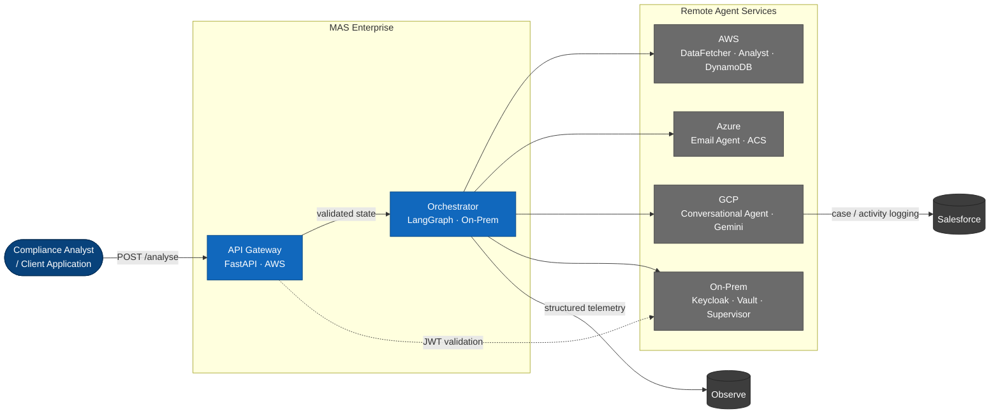
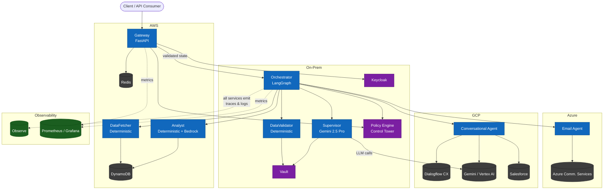
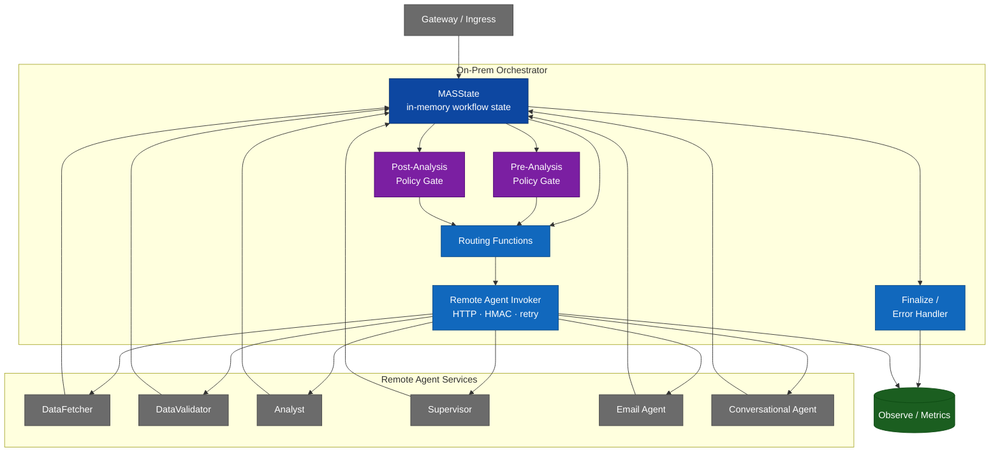

# MAS Enterprise — Architecture Blueprint

## C4 Model

### Level 1 — System Context



### Level 2 — Container View



### Level 3 — Orchestrator Component View



The C4 interpretation for this repo is:

- `System`: the distributed MAS platform as one enterprise system
- `Containers`: gateway, orchestrator, remote agent services, policy/security, and platform dependencies
- `Components`: the internals of the on-prem orchestrator, which owns state and coordinates the remote services

---

## Data Flow & State Transitions

```
HTTP Request
    │
    ▼
┌─────────────────────────────────────────────────────────────┐
│  GATEWAY (AWS — FastAPI)                                     │
│  • JWT validation  →  Keycloak on-prem JWKS                  │
│  • Rate limiting   →  Redis token bucket (100 req/min)       │
│  • Injection guard →  Regex pattern scan (15 patterns)       │
│  • PII obfuscation →  Email/PAN/SSN/Phone scrubbing          │
│  • Policy check    →  Control Tower PolicyEngine             │
└──────────────────────────┬──────────────────────────────────┘
                           │  initial_state(request_id, user_id,
                           │               tenant_id, raw_input,
                           │               security_context)
                           ▼
┌─────────────────────────────────────────────────────────────┐
│  ORCHESTRATOR (On-Prem — LangGraph entry node)               │
│  • Validates required state fields are present               │
│  • Emits first AgentExecution record                         │
│  • Owns MASState and invokes remote agent services via HTTP  │
│  • Routes unconditionally to DataFetcher Service             │
└──────────────────────────┬──────────────────────────────────┘
                           │
                           ▼
┌─────────────────────────────────────────────────────────────┐
│  DATA FETCHER SERVICE (AWS — Deterministic Agent A)          │
│  Platform: AWS DynamoDB + boto3                              │
│  • Fetches UserProfile from profiles table                   │
│  • Queries transaction history (configurable lookback)       │
│  • Retry: 3x exponential backoff on BotoCoreError/ClientError│
│  Output: FetchedData  →  state.fetched_data                  │
└──────────────────────────┬──────────────────────────────────┘
                           │
                           ▼
┌─────────────────────────────────────────────────────────────┐
│  DATA VALIDATOR SERVICE (On-Prem — Deterministic Agent B)    │
│  Platform: On-prem NVIDIA GPU (CPU-bound rules engine)       │
│  • Profile rules: email format, KYC enum, country ISO 3166   │
│  • Transaction rules: currency ISO 4217, amount range,       │
│    channel enum, no future timestamps                        │
│  • Cross-field: velocity ceiling, new-account high-value     │
│  Output: ValidationResult  →  state.validation_result        │
└──────────────────────────┬──────────────────────────────────┘
                           │
                           ▼
┌─────────────────────────────────────────────────────────────┐
│  POLICY GATE (On-Prem — Control Tower checkpoint)            │
│  • Evaluates tenant / request / fetched-data policies        │
│  • Can deny before analysis or require audit metadata        │
│  Output: state.metadata policy flags                         │
└──────────────────────────┬──────────────────────────────────┘
                           │
                    ┌──────▼──────────────┐
                    │  route_after_        │
                    │  validation()        │
                    └──┬───────────┬───────┘
            is_valid   │           │ critical issues   │ fatal error
            or warnings│           │ (skip analyst)    │
                       ▼           ▼                   ▼
          ┌────────────┐    ┌──────────────┐   ┌───────────────┐
          │  ANALYST   │    │  SUPERVISOR  │   │ ERROR HANDLER │→ END
          │  SERVICE   │    │  SERVICE     │   └───────────────┘
          │  (AWS)     │    │  (On-Prem)   │
          └─────┬──────┘    └──────┬───────┘
                │ analysis_result  │ supervisor_output
                ▼
┌─────────────────────────────────────────────────────────────┐
│  POLICY GATE (On-Prem — post-analysis checkpoint)           │
│  • Evaluates analysis-dependent policies (e.g. risk gates)  │
│  • Can deny before supervisor/email side effects            │
└──────────────────────────┬──────────────────────────────────┘
                           │
                           └──────────────────┐
                                              ▼
                           │
                           ▼
┌─────────────────────────────────────────────────────────────┐
│  SUPERVISOR SERVICE (On-Prem — Non-Deterministic Agent C)    │
│  Model: Gemini 2.5 Pro (NVIDIA AI Enterprise / on-prem NIM) │
│  • Builds structured prompt from validated data and optional │
│    analysis output                                           │
│  • Calls Gemini with response_mime_type="application/json"   │
│  • Runs GUARDRAIL pipeline:                                  │
│    1. Schema validation (Pydantic)                           │
│    2. Structural checks (summary length, rec count)          │
│    3. Forbidden token scan (PAN regex, injection patterns)   │
│  • On failure: activates graceful degradation fallback       │
│  • Handles upstream degraded paths when analyst is skipped   │
│  • Manages state: token_usage, execution_history appended    │
│  Output: SupervisorOutput  →  state.supervisor_output        │
└──────────────────────────┬──────────────────────────────────┘
                           │
                    ┌──────▼──────────────┐
                    │  route_after_        │
                    │  supervisor()        │
                    └──┬───────────┬───────┘
         send_email    │           │  utterance present
                       ▼           ▼
          ┌────────────────┐  ┌──────────────────────┐
          │  EMAIL AGENT   │  │  CONVERSATIONAL AGENT │
          │  SERVICE       │  │  SERVICE             │
          │  (Azure)       │  │  (GCP)               │
          └────────┬───────┘  └──────────┬────────────┘
                   │                     │
            ┌──────▼──────────────────────▼──────┐
            │  route_after_email()                │
            └──────────────────┬─────────────────┘
                               │
                               ▼
┌─────────────────────────────────────────────────────────────┐
│  FINALIZE (On-Prem — Orchestrator terminal node)             │
│  • Aggregates supervisor_output + analysis_result            │
│  • Checks email_receipt.status for delivery confirmation     │
│  • Computes pipeline_duration_ms from execution_times        │
│  • Assembles FinalResponse  →  state.final_response          │
└──────────────────────────┬──────────────────────────────────┘
                           │
                           ▼
                          END  →  HTTP 200 AnalyseResponse
```

---

## Agent Role Summary

| Agent | Type | Platform | Model | Inputs | Outputs |
|---|---|---|---|---|---|
| Orchestrator | Coordinator | On-Prem | None | MASState | Routing decisions |
| DataFetcher | Deterministic A | AWS | None | user_id, tenant_id | FetchedData |
| DataValidator | Deterministic B | On-Prem | Optional SLM | FetchedData | ValidationResult |
| PolicyGate | Deterministic Control | On-Prem | None | request/fetched/analysis context | allow/deny/audit metadata |
| Analyst | Deterministic A | AWS | Optional Bedrock | FetchedData+Validation | AnalysisResult |
| Supervisor | Non-Deterministic C | On-Prem | Gemini 2.5 Pro | All above | SupervisorOutput |
| Email Agent | Copilot | Azure | None (template) | SupervisorOutput | EmailDeliveryReceipt |
| ConversationalAgent | Conversational | GCP | Dialogflow CX + Gemini | Utterance + Context | ConversationalResponse |

---

## State Machine

```
State field          Set by              Read by
─────────────────────────────────────────────────────
fetched_data         DataFetcher         DataValidator, Analyst, Supervisor
validation_result    DataValidator       Orchestrator (routing), Analyst, Supervisor
analysis_result      Analyst             Supervisor, EmailAgent, FinalizeNode
metadata             Gateway/PolicyGate  Routing, policy audit, operational fields
supervisor_output    Supervisor          EmailAgent, ConversationalAgent, FinalizeNode
email_receipt        EmailAgent          FinalizeNode
conversational_resp  ConversationalAgent FinalizeNode
final_response       FinalizeNode        Gateway (HTTP response)
execution_history    Every agent         Observe exporter, audit log
errors               Every agent         FinalizeNode, ErrorHandler
token_usage          Supervisor          Observe, Prometheus
execution_times      Every agent         FinalizeNode (pipeline_duration_ms)
security_context     Gateway             All agents (authorisation checks)
```

---

## Platform Mapping

```
┌────────────────────────────────────────────────────────────────┐
│  ON-PREMISES  (NVIDIA B200/B300 GPU cluster)                   │
│  • Orchestrator (CPU)                                          │
│  • DataValidator (CPU — rule engine)                           │
│  • PolicyGate (CPU — control tower checkpoint)                 │
│  • Supervisor (GPU — Gemini 2.5 Pro via NVIDIA NIM)            │
│  • Keycloak Identity Server (replaces Microsoft Entra ID)      │
│  • HashiCorp Vault (KMS for on-prem agents)                    │
│  • Prometheus + Grafana (metrics)                              │
└────────────────────────────────────────────────────────────────┘

┌────────────────────────────────────────────────────────────────┐
│  AWS                                                           │
│  • Gateway (FastAPI on ECS/EKS)                                │
│  • DataFetcher (Lambda / ECS task)                             │
│  • Analyst (ECS + optional Bedrock)                            │
│  • DynamoDB (profiles, transactions)                           │
│  • S3 (reports, audit exports)                                 │
│  • KMS (data encryption keys)                                  │
│  • Redis (ElastiCache — rate limiting)                         │
│  • Bedrock (optional narrative enrichment)                     │
└────────────────────────────────────────────────────────────────┘

┌────────────────────────────────────────────────────────────────┐
│  AZURE                                                         │
│  • Email Agent (Azure Communication Services)                  │
│  • Recommendation: Replace MS Entra ID with on-prem Keycloak   │
└────────────────────────────────────────────────────────────────┘

┌────────────────────────────────────────────────────────────────┐
│  GCP                                                           │
│  • Conversational Agent (Dialogflow CX)                        │
│  • Gemini-backed supervision and fallback reasoning            │
│  • Cloud Logging (conversation audit)                          │
└────────────────────────────────────────────────────────────────┘
```

---

## Microsoft Entra ID Replacement

**Recommended replacement: Keycloak (on-premises)**

Keycloak is an enterprise-grade, open-source Identity Provider that provides
full feature parity with Microsoft Entra ID without the cloud dependency:

| Entra ID Feature | Keycloak Equivalent |
|---|---|
| OAuth 2.0 / OIDC | Native support |
| SAML 2.0 (legacy apps) | Native SAML SP/IdP |
| Multi-factor authentication | TOTP, WebAuthn/FIDO2 |
| Active Directory sync | LDAP user federation |
| Group/role-based access | Realm roles + groups |
| Conditional access policies | Keycloak Authentication Policies |
| Service principal / client credentials | OAuth 2.0 client credentials flow |
| Token introspection | `/token/introspect` endpoint |
| Fine-grained authorisation | UMA 2.0 |

**Migration path:**
1. Deploy Keycloak HA cluster (3 nodes, PostgreSQL backend).
2. Enable LDAP federation to sync existing Active Directory users.
3. Configure SAML 2.0 for legacy line-of-business applications.
4. Migrate modern services to OIDC client credentials (M2M) and auth-code (human).
5. Run Entra ID and Keycloak in parallel during validation.
6. Decommission Entra ID external dependency.

---

## Security Architecture (Zero Trust)

```
Every request:
  1. JWT validated against Keycloak on-prem JWKS (RS256, audience + issuer check)
  2. Roles checked: requester must hold mas:analyse
  3. mTLS client cert fingerprint bound to JWT (service-to-service)
  4. HMAC-signed inter-agent payloads (X-MAS-Signature header)
  5. PII scrubbed from all log events before emission
  6. KMS-backed key rotation (quarterly) for tokenisation and encryption
  7. All secrets fetched at runtime from Vault/AWS KMS — never env files in prod
```

---

## Observability Stack

```
Agent execution  →  structlog (JSON)  →  stdout
                                      →  Observe HTTP ingest (datastream: mas-enterprise)

LLM token usage  →  structlog event
                 →  Prometheus counter (mas_llm_tokens_total)
                 →  Observe event

Pipeline result  →  Observe event (risk_level, duration, email_sent)
                 →  Prometheus histogram (mas_pipeline_duration_ms)

Security events  →  structlog WARNING
                 →  Prometheus counter (mas_security_events_total{event_type})

Execution history and token usage are emitted from the gateway after graph
completion using the accumulated centralized state, preserving traceability
across deterministic and non-deterministic agent transitions.
```
